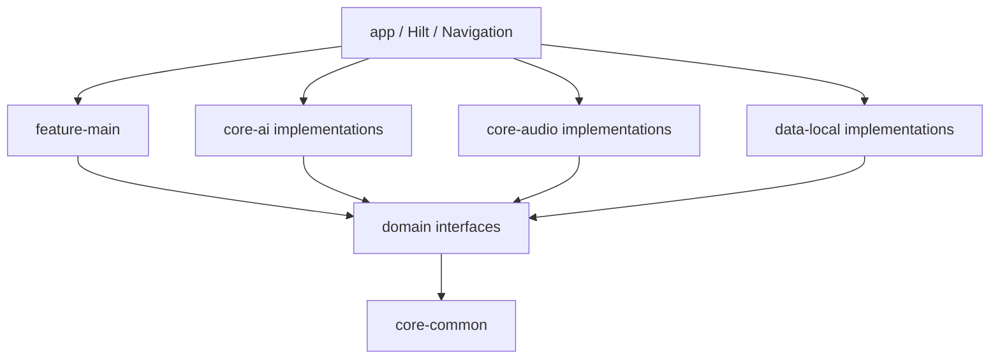
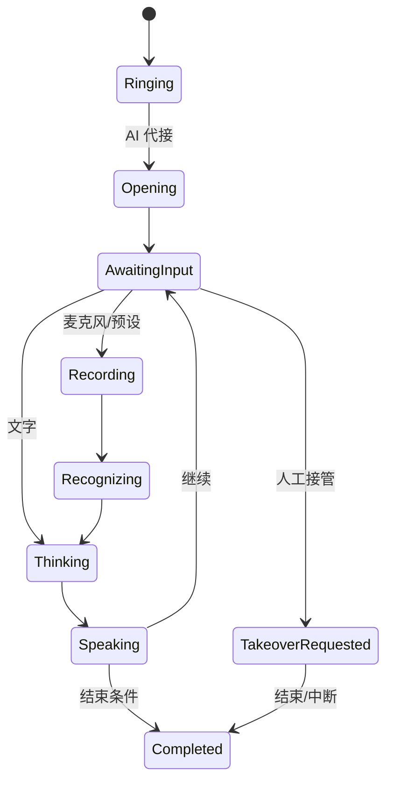

# 架构说明

项目使用 MVVM、Clean Architecture、Repository Pattern、Hilt、Coroutines/StateFlow、Room、DataStore、WorkManager 和 Navigation Compose。

`feature-main` 只调用 `domain` 接口。`app` 在 Hilt 中装配规则、Room、Android 音频、Vosk ASR 和 sherpa-onnx TTS 实现。语音运行时通过 `SpeechRecognizer`、`VoiceActivityDetector` 和 `SpeechSynthesizer` 等接口接入，业务页面与 `CallSessionController` 不直接依赖具体引擎。

## 会话单一数据源

`DefaultCallSessionController` 持有唯一的 `StateFlow<CallSessionSnapshot>`。Activity、Composable 和 ViewModel 不复制状态机，也不直接写会话状态。

每个会话操作由 `Mutex` 串行化。AudioRecord、模型推理、文件和数据库工作均在 IO/Default dispatcher 上执行。应用退到后台时先取消音频源，防止会话锁等待阻塞资源释放。

## JSON 状态机

生产规则位于 `app/src/main/assets/dialogue_rules.json`，包含：

- `sceneId`、`intentId`、关键词、同义词、正则；
- `stateId`、系统提问、预期槽位；
- transition 的 `nextState`、回复模板和结束标记；
- 每节点重试策略、兜底回复、结束条件；
- 结构化结果字段。

规则 DTO 和加载器位于 `core/ai/rules`。未来 Room/可视化编辑器只需实现 `RuleProvider`，状态机无需迁移到 ViewModel。

## 数据路径

1. `AudioInputSource` 产出 16-bit PCM 和可选 Mock 文本提示。
2. PCM 追加到 `SessionRecordingStore` 的临时流。
3. VAD/ASR/规则模块生成一轮回复；回复音频也追加到模拟会话 WAV。
4. 结束时 WAV 写入 44 字节头并原子提交。
5. `SummaryGenerator` 生成模板摘要，`CallRepository` 将结果保存到 Room。
6. WorkManager 每 24 小时执行差异化保留策略。

默认会话 WAV 与可选的运营商 SIM 通话实验是两条不同链路。前者由应用会话音频源和输出组成；后者依赖 Shizuku、scrcpy 与厂商音频策略，不能由默认 WAV 结果推断。

## 设备分级与语音运行时

`AndroidDeviceProfileManager` 采集设备事实、持久化首次真实推理样本并输出 `DeviceProfile`。`AdaptiveSpeechRuntime` 是 ASR/TTS 生命周期协调点，按该 Profile 决定预热、TTS 线程、并驻和释放；UI、会话控制器与 native factory 不再各自判断设备档位。

具体实现位于 `core/ai/adaptation`，使用前还应结合 `docs/LIMITATIONS.md` 核对未验证边界。
